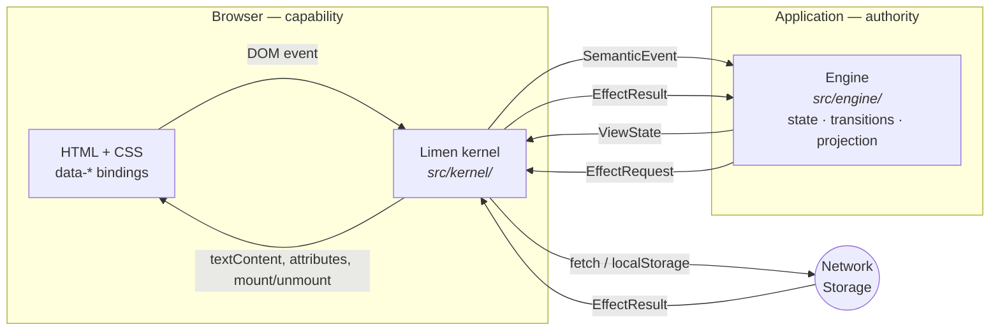

# Limen

**An explicit boundary that keeps browser capabilities separate from
application authority.**

*Limen* (Latin): a threshold — the stone at the base of a doorway. Your
application stands behind it. The browser stands in front of it. Nothing
crosses except plain, serializable data.

```sh
npm install @echelon-foundry/typescript-wasm-kernel
```

> **Package name:** Limen is the product name; the published package is still
> `@echelon-foundry/typescript-wasm-kernel`. Nothing was renamed — no
> deprecation, no shim, no migration. See
> [docs/18-naming-and-compatibility.md](docs/18-naming-and-compatibility.md).

> **Where is the WebAssembly?** There isn't any — not yet. The name described a
> *boundary shape* that a WASM module could later be driven through. Today the
> application side is TypeScript. This is answered in full in
> [docs/17-wasm-migration.md](docs/17-wasm-migration.md), and it is the first
> thing most newcomers ask.

---

## The core idea

```text
HTML          owns document structure.
CSS           owns presentation.
The browser   owns layout, rendering, and native input behavior.
Limen         is the threshold: it carries events in and effects out.
The engine    owns state, transitions, validation, and what to show.
```

The Limen kernel understands **six HTML attributes** and no application
vocabulary at all. It does not know what `"checkAvailability"` means or what a
`"customers"` list is. It moves opaque strings and plain data across a
boundary — which is precisely what stops application logic from accumulating
in the browser layer.

## Thirty-second architecture



The two arrows crossing the middle are the entire contract. They are defined in
[`src/protocol.ts`](src/protocol.ts) — about 80 lines, and the single most
useful file to read.

## Why it exists

Most browser applications end up with the same problem: the truth about what
the application is doing gets smeared across three places — a JavaScript store,
the DOM itself, and the server. Each can disagree with the others, and no
single file tells you which is right.

Limen takes a different position: **exactly one place owns application state,
and it is not the browser.**

| Benefit | Why it follows |
| --- | --- |
| One source of truth | Application state exists only in the engine. The DOM is output, never input. |
| Illegal states are unrepresentable | State is a discriminated union, so "saving *and* already saved" cannot be written down. |
| Deterministic transitions | `(state, command) → state` is pure, and testable without a browser. |
| Honest failure | Every effect reports `Success`, `Failure`, `Cancelled`, or `OutcomeUnknown`. "We don't know" is a real, handled outcome. |
| Portable logic | The engine touches no browser API, so it can move to another language without rewriting behavior. |
| Less to audit | Browser access lives in one file, and a build check fails if it leaks. |
| Easier for agents | There is one correct place for any given change, and it can be stated as a rule. |

These are consequences of the boundary, not aspirations. The mechanically
enforced one is the second-to-last:
[`scripts/check-architecture.ts`](scripts/check-architecture.ts) fails the build
if `src/engine/**` so much as mentions `document`, `window`, `fetch(`,
`localStorage`, or `sessionStorage`.

**Tradeoffs are real**, and documented rather than hidden: no routing or
history, no browser capabilities beyond HTTP and `localStorage`, no focus
management, no list virtualization, more ceremony than a small component
framework for a genuinely simple page. See
[docs/01-architecture.md § Honest limits](docs/01-architecture.md#6-honest-limits).

## The smallest working example

Three files. Nothing elided.

**`index.html`** — structure and bindings:

```html
<button data-event="increment">Add one</button>
<button data-event="reset" data-bind-disabled="resetDisabled">Reset</button>
<p>Count: <span data-text="count">0</span></p>

<script type="module" src="./main.js"></script>
```

**`engine.ts`** — all the meaning:

```ts
import type { BrowserToEngineMessage, EngineToBrowserMessage, EngineTransport, ViewState }
  from "@echelon-foundry/typescript-wasm-kernel/protocol";

type State = { readonly count: number };

// Pure. No DOM, no fetch, no globals.
const transition = (state: State, name: string): State => {
  switch (name) {
    case "increment": return { count: state.count + 1 };
    case "reset":     return { count: 0 };
    default: throw new Error(`Unrecognized event: ${name}`);
  }
};

// Pure. Produces what the view needs — including whether Reset is *allowed*.
const project = (state: State): ViewState => ({
  count: state.count,
  resetDisabled: state.count === 0,
});

export function createCounterTransport(): EngineTransport {
  let state: State = { count: 0 };
  return {
    async start() {},
    async dispatch(message: BrowserToEngineMessage): Promise<EngineToBrowserMessage> {
      if (message.kind === "Event") state = transition(state, message.event.name);
      return { view: project(state), effects: [], cancellations: [] };
    },
  };
}
```

**`main.ts`** — the wiring, in full:

```ts
import { BrowserKernel } from "@echelon-foundry/typescript-wasm-kernel";
import { createCounterTransport } from "./engine.js";

await new BrowserKernel(createCounterTransport(), document).start();
```

A click becomes `SemanticEvent { name: "increment" }`, `transition` returns a
new state, `project` turns it into `{ count: 1, resetDisabled: false }`, and the
kernel writes `1` into the `<span>` and enables the button.

Note `resetDisabled`. The engine decides whether Reset is available; the DOM
never re-derives it from the number on screen. That habit — **project
capabilities, don't reconstruct them** — is most of what using Limen well
consists of.

This example is real, and the test suite executes it on every run:
[`examples/01-counter/`](examples/01-counter/).

## The lifecycle CLI

The same package is also a command-line tool that installs the Limen boundary
into a repository and keeps it honest. No .NET runtime is required — a
self-contained binary ships for each supported platform.

```sh
npx @echelon-foundry/typescript-wasm-kernel init      # install the boundary. Idempotent.
npx @echelon-foundry/typescript-wasm-kernel status    # what is installed, and is it valid?
npx @echelon-foundry/typescript-wasm-kernel verify    # check it. Read-only.
npx @echelon-foundry/typescript-wasm-kernel upgrade   # move to this version, safely.
npx @echelon-foundry/typescript-wasm-kernel doctor    # explain what is wrong, and how to fix it.
```

Once installed, the executable is simply `limen`.

`init` creates three things: `limen.config.json` (yours — it names which
directories are engine and which are kernel), a CI workflow that runs
`verify --strict`, and an installation manifest at `.echelon/limen.json`. It
never overwrites a file you have edited, and never overwrites a file that was
there before it arrived. Running it twice makes no second round of changes.

`verify` then enforces the boundary this README opens with: engine code must not
name `document`, `window`, `fetch(`, `localStorage` or `sessionStorage`, and
neither side may use `eval`. It is a lexical check — a guard rail, not a proof.

For CI and agents, every command takes `--json` (a single document on stdout,
messages on stderr) and branches on stable exit codes; `init` and `upgrade` take
`--dry-run` and `--check`. Nothing prompts, so nothing hangs.

```sh
npx @echelon-foundry/typescript-wasm-kernel verify --strict     # 0 valid, 3 invalid
npx @echelon-foundry/typescript-wasm-kernel init --dry-run --json
```

Full reference: **[docs/20-lifecycle-cli.md](docs/20-lifecycle-cli.md)**. What it
writes, who owns which file, and what an upgrade may change:
**[docs/21-installation-and-upgrade.md](docs/21-installation-and-upgrade.md)**.

The CLI is implemented in F# (`cli/Limen.Core/`, `cli/Limen.Cli/`); the Node
side is a launcher that selects a binary and forwards arguments, and contains no
lifecycle logic.

## The site

Limen's own website is built **with** Limen — its interactive sections are a
real Limen application driven by the same package you would install, and its
prose is ordinary static HTML. Source in [`site/`](site/), assembled by
[`scripts/build-site.ts`](scripts/build-site.ts), deployed by
[`.github/workflows/pages.yml`](.github/workflows/pages.yml).

```sh
npm run serve:site   # build and serve on http://localhost:4174
```

The demos page performs genuinely real requests to show all four effect
outcomes — nothing is stubbed or animated.

## Run it

```sh
npm install
npm run check        # build + architecture, docs and site checks + 88 tests
npm run build
npm run build:examples
python3 -m http.server 4173
```

| | |
| --- | --- |
| Reference feature | <http://localhost:4173/> |
| Examples | `/examples/01-counter/` … `/examples/06-time-entries/` |
| Every primitive, interactively | `/examples/kitchen-sink.html` |

The network-backed examples call endpoints that do not exist without a backend.
That is deliberate — they demonstrate the typed failure states.

## Examples

Each is executed by [`test/examples.test.ts`](test/examples.test.ts) against its
own real `index.html`, so none can silently rot.

| Example | Demonstrates |
| --- | --- |
| [01-counter](examples/01-counter/) | the minimum: event → transition → projection → DOM |
| [02-form](examples/02-form/) | validation, capability projection, rejected illegal transitions |
| [03-fetch-data](examples/03-fetch-data/) | HTTP effect, lists, all four outcomes, stale-result rejection |
| [04-save-data](examples/04-save-data/) | full save lifecycle, storage effect, non-idempotent write safety |
| [05-multi-screen](examples/05-multi-screen/) | screens as state, shared vs. screen-local lifetimes |
| [06-time-entries](examples/06-time-entries/) | a realistic feature: load, validate, add, mutate, refresh |

## Documentation

| You are… | Start here |
| --- | --- |
| New to Limen | [docs/01-architecture.md](docs/01-architecture.md) |
| Building your first app | [docs/02-getting-started.md](docs/02-getting-started.md) |
| **An AI coding agent** | [AGENTS.md](AGENTS.md), then [docs/14-agent-guide.md](docs/14-agent-guide.md) |
| Looking for an API | [docs/11-api-reference.md](docs/11-api-reference.md) |
| Doing one specific task | [docs/15-recipes.md](docs/15-recipes.md) |
| Debugging | [docs/16-troubleshooting.md](docs/16-troubleshooting.md) |
| Adopting Limen elsewhere | [docs/10-integration-guide.md](docs/10-integration-guide.md) |
| Using the CLI | [docs/20-lifecycle-cli.md](docs/20-lifecycle-cli.md) |
| Asking what `init` will change | [docs/21-installation-and-upgrade.md](docs/21-installation-and-upgrade.md) |
| Asking about WASM | [docs/17-wasm-migration.md](docs/17-wasm-migration.md) |
| Asking about the name | [docs/18-naming-and-compatibility.md](docs/18-naming-and-compatibility.md) |

Full index: **[docs/README.md](docs/README.md)**.

## Evidence

Limen's benefits are stated above as *architectural consequences* — things that
follow from the boundary — not as measured outcomes.

**No controlled measurement of Limen's effect on development time, token
consumption, cost, or defect rate has been performed.** Where evidence exists,
it is about SDE, or about language and style — **not** about Limen. Those are
not conflated, and no quantitative claim about Limen appears anywhere in this
documentation.

Full accounting, including what a Limen trial would have to measure and why one
has not been run: **[docs/19-evidence.md](docs/19-evidence.md)**.

Known gaps, deferred work, and the reasoning behind both are tracked in
[docs/ROADMAP.md](docs/ROADMAP.md) and
[docs/DOCUMENTATION-AUDIT.md](docs/DOCUMENTATION-AUDIT.md).

## Requirements

- **Node** ≥ 22 to build and test (the published package is browser code)
- **TypeScript** ≥ 5.9 if you consume the types
- **Browsers**: any with ES2022 modules, `fetch`, and `AbortController`
- **Runtime dependencies**: none — the kernel imports nothing at runtime
- **The CLI**: needs no .NET runtime; a self-contained binary ships for Linux
  x64/arm64, Windows x64, and macOS x64/arm64. Any other platform exits `7`
  saying so. Building it from source needs the .NET SDK 8.
- **Versioning**: semver, currently `0.x` — the protocol may still change in a
  minor release. See [docs/11-api-reference.md](docs/11-api-reference.md#stability-and-compatibility).

## Development

```sh
npm run check              # the gate: build, checks, and all tests
npm run build              # tsc → dist/
npm run build:examples     # tsc → examples/**/*.js
npm run check:architecture # boundary enforcement
npm run check:docs         # links, paths, orphans
```

Working on the lifecycle CLI additionally needs the **.NET SDK 8**:

```sh
npm run test:cli           # dotnet test — the F# lifecycle core
npm run build:cli          # publish the binary for this platform
npm run build:cli:all      # publish all five platform binaries (what npm pack ships)
```

`npm run check` runs without the .NET SDK; the CLI tests in `test/cli.test.ts`
report as **skipped** rather than passing when no binary has been built.

Contributing — including AI agents — starts with [AGENTS.md](AGENTS.md) and
[docs/12-design-rules.md](docs/12-design-rules.md).

This repository follows [SDE](.sde/README.md) and the ROS work protocol:
identify a work item and run `./ros work begin ID` **before** meaningful
changes, or CI's `validate` job will reject the branch.

## Release

CI builds, tests, and validates the npm tarball on every push and pull request.
Publishing is triggered by a semantic-version tag and authenticates with npm
Trusted Publishing over GitHub OIDC — no npm token is stored in GitHub.

1. `npm version patch` (or `minor`/`major`)
2. `git push --follow-tags`

The publish workflow rejects a tag whose version does not match `package.json`,
then runs all checks before publishing. Version `0.2.1` releases as tag
`v0.2.1`.

## License

MIT — see [LICENSE](LICENSE).

---

**Limen** — an [Echelon Foundry](https://echelonfoundry.com) engineering project.
