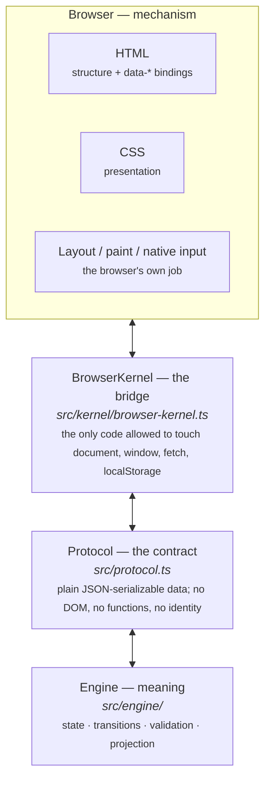
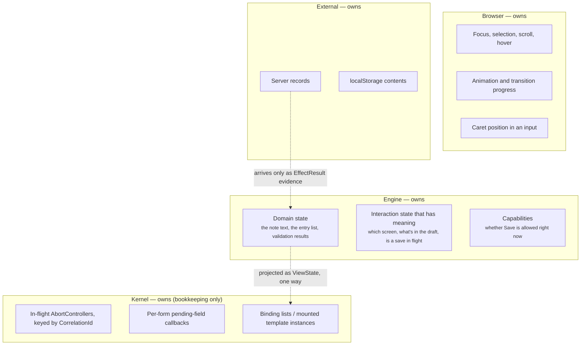

# Architecture

**What this answers:** what runs where, who owns what, and why the boundaries
are drawn where they are.

If you read only one other thing afterwards, make it
[`src/protocol.ts`](../src/protocol.ts). It is about 80 lines and it *is* the
architecture.

---

## 1. The four layers



Each layer has exactly one job, and the jobs do not overlap.

### HTML owns structure

Ordinary HTML. Semantic elements, labels, `required`, `type="email"`, ARIA
attributes. The kernel adds no elements of its own and no framework syntax —
only `data-*` attributes, which are valid HTML.

Native browser behavior stays switched on. `<form>` validation runs *before*
the kernel dispatches anything: `BrowserKernel.#fire` calls
`form.reportValidity()` and stops if it returns false
([`browser-kernel.ts`](../src/kernel/browser-kernel.ts), `#fire`). You are not
expected to reimplement email-syntax checking in the engine — though the engine
still validates, because HTML validation is a courtesy to the user, not a
guarantee.

### CSS owns presentation

Ordinary CSS. Hover, focus, transitions, popovers, animation, media queries —
none of it goes through the kernel, and the kernel does not track any of it.
Roadmap item 11 calls this out explicitly: browser-local presentation state is
left entirely to CSS and native behavior, and there is no kernel code to test
because none exists.

When the engine wants to *influence* styling, it projects data and CSS reacts to
it. [`examples/05-multi-screen/`](../examples/05-multi-screen/) projects
`active: true` into `aria-current`, and the stylesheet targets
`[aria-current="true"]`. The engine did not pick a color; CSS did.

### The kernel owns browser mechanism

One file, [`src/kernel/browser-kernel.ts`](../src/kernel/browser-kernel.ts),
does all of it:

- binds `data-*` attributes to DOM nodes at startup
- forwards DOM events as `SemanticEvent`s
- applies a `ViewState` to the DOM (text, attributes, mount/unmount, lists)
- performs `EffectRequest`s (`fetch`, `localStorage`) and classifies outcomes
- funnels every round-trip through one error boundary

What it does **not** do is decide anything. It never branches on what an event
name or a view key *means*. `"checkAvailability"` and `"customers"` are opaque
strings to it.

### The engine owns meaning

Everything that constitutes the application: what states exist, which
transitions are legal, what is valid, what to show, and what external work is
needed. It has no access to the browser — enforced mechanically, see §4.

---

## 2. The contract

Exactly two message shapes cross the boundary.

**Browser → Engine** ([`protocol.ts`](../src/protocol.ts)):

```ts
type BrowserToEngineMessage =
  | { kind: "Initialize"; protocolVersion: 1; capabilities: ["Http", "Storage"] }
  | { kind: "Event";        event:  SemanticEvent }
  | { kind: "EffectResult"; result: EffectResult };

type SemanticEvent = {
  kind: "Event";
  name:   string;   // the data-event value, verbatim
  key?:   string;   // the enclosing data-each item's key, if any
  value?: string;   // the element's .value, for inputs/selects/textareas
};
```

**Engine → Browser**:

```ts
type EngineToBrowserMessage = {
  view:          ViewState;                 // what to show
  effects:       readonly EffectRequest[];  // what to do in the outside world
  cancellations: readonly CorrelationId[];  // in-flight effects no longer wanted
};
```

Three properties of this contract carry all the weight:

1. **It is data, not calls.** No callbacks, no DOM nodes, no object identity, no
   shared memory. Every value survives `JSON.stringify`/`JSON.parse` unchanged.
   That is what makes an out-of-process or WebAssembly engine possible later
   without redesigning anything.
2. **It is generic.** The kernel's types mention no domain concept. `ViewState`
   is `{ [key: string]: string | number | boolean | ViewItem[] }`. There is no
   place in the kernel where a feature could add a special case.
3. **It is total.** Every engine response carries a complete `ViewState`. The
   kernel does not diff against a previous response or apply patches — the
   engine says what things are now, and the kernel makes the DOM match.

---

## 3. Who owns what state

This is the question most architectures answer badly, so it gets its own
diagram. "Owns" means: this is the only thing allowed to change it, and if two
places disagree, this one is right.



The critical lines:

- **The engine owns everything with meaning.** Including things that feel like
  "UI state": which screen is showing, whether a panel is open, what's typed in
  a field. If the application would behave differently based on it, it is
  application state.
- **The kernel owns no application state at all.** Its three pieces of state are
  DOM-identity bookkeeping the engine has no reason to know about
  (see ROADMAP.md's "Duplicated kernel state" row).
- **The browser owns ephemeral presentation.** Focus, scroll, caret. The kernel
  deliberately does not track or restore these. Where that costs something —
  focus after a list item is removed — the roadmap records it as a known gap
  rather than pretending otherwise.
- **External systems own their own records.** The engine never holds "the truth
  from the server". It holds *evidence it received*, which may be stale, and
  which arrived with a known outcome classification.

### What "the DOM is output" means concretely

The DOM is never read for application truth. There is exactly one place the
kernel reads from an element — `readValue()`, which takes `.value` off an
input/select/textarea to populate `SemanticEvent.value`. That is transport of a
user's keystrokes, not a state read: the engine decides what to do with it, and
the engine's copy is authoritative from that moment on.

There is no `querySelector` anywhere in the engine, and there cannot be.

---

## 4. What is actually enforced

An important distinction, and one the repository is careful about: some rules
are checked by a script, some by the TypeScript compiler, and some only by
review. `architecture.yaml` states this in its own header comment, and it is
worth repeating.

| Rule | Enforced by |
| --- | --- |
| `src/engine/**` contains no `document`, `window`, `fetch(`, `localStorage`, `sessionStorage` | **Script** — [`scripts/check-architecture.ts`](../scripts/check-architecture.ts), run by `npm test` |
| `src/engine/**` contains no `any` or `dynamic` | **Script** — same |
| No `eval`, `SetInnerHtml`, or `ExecuteScript` anywhere in `src/` | **Script** — same |
| Every state is handled in every `switch` | **Compiler** — exhaustive unions + `assertNever` |
| Protocol values are JSON-serializable | **Compiler** — `ViewValue` admits only primitives and flat item arrays |
| Documentation links and example code stay valid | **Script** — [`scripts/check-docs.ts`](../scripts/check-docs.ts) and [`test/examples.test.ts`](../test/examples.test.ts) |
| No second application-state store appears | **Review only** |
| The kernel doesn't branch on domain meaning | **Review only** |

Do not assume a claim in `architecture.yaml` is automated just because it is
written down. The mechanically-checked subset is exactly the rows marked
**Script** above.

---

## 5. Why draw the line here

Each rule exists because of a specific failure it prevents. These are the
reasons — not decoration, but the thing to reason from when you hit a case the
docs don't cover.

**Why must the engine own all application state?**
Because state that lives in two places will disagree, and when it does, nothing
tells you which one is right. Bugs of that kind are not fixed by being careful;
they are fixed by making the second copy impossible. One owner also means one
place to look when behavior is wrong, which matters much more for an AI agent
than for a human — a human asks; an agent guesses and continues.

**Why must the kernel stay ignorant of meaning?**
Because the moment it knows what one event name means, it becomes a place where
application logic can accumulate. Bridges that "just handle this one case" grow
into second application frameworks. Keeping the kernel's vocabulary at six
generic attributes means there is no hook for a feature to grab.

**Why represent effects as data instead of just calling `fetch`?**
Three reasons. It keeps the engine pure, so transitions are testable with no
browser and no network. It makes every external interaction visible at the
boundary rather than buried in a function somewhere. And it forces the failure
cases into the type system: you cannot request an Http effect without handling
what happens when it fails.

**Why does `OutcomeUnknown` exist separately from `Failure`?**
Because a request that timed out *after dispatch* may have been processed. The
kernel cannot know. Calling that a failure is a lie that causes duplicate
charges and duplicate records. The honest answer is "we don't know", and the
correct recovery depends on the domain: a GET can simply be retried
([03-fetch-data](../examples/03-fetch-data/)), a POST must be reconciled
([04-save-data](../examples/04-save-data/)). Only the engine can make that call,
which is exactly why the kernel reports the outcome instead of deciding.

**Why must capabilities be projected instead of derived in the DOM?**
Because deriving them puts a copy of a business rule in the markup. "Disable
Save when the text is empty" is a rule; if CSS or JavaScript re-derives it, the
rule now exists in two places and will drift. Projecting `saveDisabled` keeps
one rule in one file.

**Why is the protocol serializable when nothing is serialized today?**
Because the alternative is a redesign later. `DirectTypeScriptTransport` passes
objects in-process and no serialization occurs (ROADMAP item 12). But because
the types admit nothing unserializable, adding a codec is additive rather than
structural. See [17-wasm-migration.md](17-wasm-migration.md).

---

## 6. Honest limits

Things this architecture does not currently give you. None of these are
oversights being hidden — each is recorded in [ROADMAP.md](ROADMAP.md).

- **No routing or history integration.** Back/forward buttons do not navigate
  between screens. See [08-multi-screen-applications.md](08-multi-screen-applications.md).
- **No browser capabilities beyond Http and `localStorage`.** No clipboard, no
  files, no timers, no navigation, no `IndexedDB`. Adding one is a protocol
  change — see [15-recipes.md](15-recipes.md#add-a-new-browser-capability).
- **No focus management.** Removing a focused list item loses focus.
- **No list virtualization.** Every projected item becomes a DOM node.
- **No scheduling primitives.** No built-in debounce; `data-on="input"`
  dispatches on every keystroke.
- **No serialization boundary yet**, therefore no WASM engine yet.

The deferrals are deliberate policy, not backlog: this repository treats
building ahead of a demonstrated need as an architecture violation in itself
(ROADMAP's 🧊 legend). Build them when a feature requires them.

---

## Related

- [03-kernel-lifecycle.md](03-kernel-lifecycle.md) — the same picture over time
- [04-state-model.md](04-state-model.md) — how to shape a `State` type
- [12-design-rules.md](12-design-rules.md) — these rules as MUST/SHOULD/MAY
- [13-anti-patterns.md](13-anti-patterns.md) — what breaking these looks like
