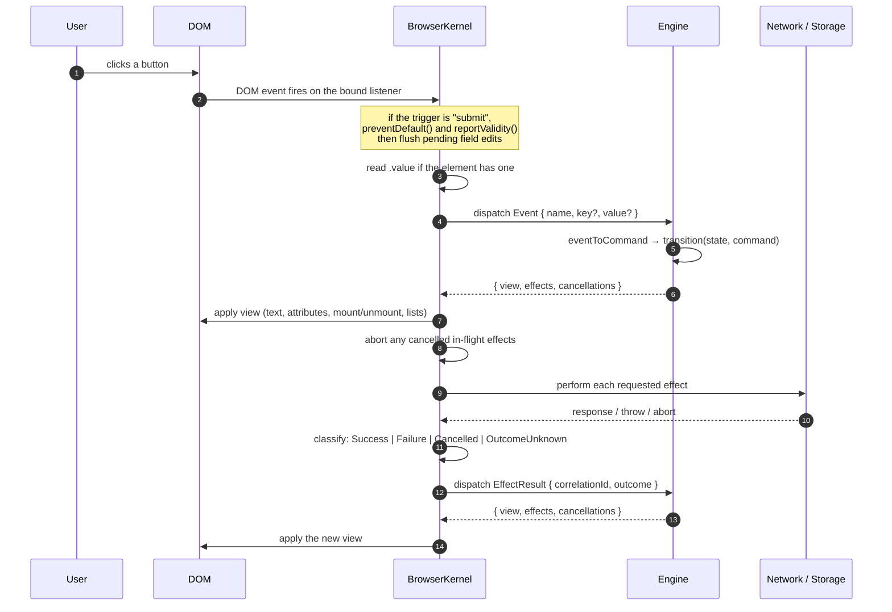

# Kernel lifecycle

**What this answers:** exactly what happens from page load through an
interaction and back to the screen, verified step by step against
[`src/kernel/browser-kernel.ts`](../src/kernel/browser-kernel.ts).

---

## Startup, step by step

### 1. The browser loads the HTML

Ordinary parsing. The kernel is not involved. Whatever placeholder text your
markup contains is what is on screen at this moment.

### 2. The module script runs

```html
<script type="module" src="./dist/main.js"></script>
```

`type="module"` is deferred by default, so this runs after the document is
parsed — which is why `document.body` is guaranteed to exist in the next step.

### 3. The kernel is constructed

```ts
new BrowserKernel(transport, document, diagnostics?)
```

The constructor only stores its three arguments. Nothing is bound, nothing is
dispatched, no DOM is touched. Construction is inert; `start()` does the work.

The third argument is optional and defaults to a no-op
([`diagnostics.ts`](../src/kernel/diagnostics.ts)).

### 4. `start()` starts the transport

```ts
try {
  await this.transport.start();
} catch (error) {
  this.#diagnostics.report({ kind: "BridgeError", phase: "dispatch", detail: String(error) });
  return;                       // ← no binding, no Initialize
}
```

This is where a real WebAssembly transport would fetch and instantiate its
module. `DirectTypeScriptTransport.start()` is an empty async function, because
an in-process engine has nothing to load.

**If `start()` rejects, the kernel stops here.** No bindings are created, no
`Initialize` is dispatched, and the page stays at its placeholder content. The
failure is reported to diagnostics and nothing is thrown. A page that renders
placeholder text forever, with a `BridgeError` in diagnostics, means this.

### 5. The DOM is scanned once

```ts
this.#bindElement(this.document.body, this.#root, undefined);
```

A single recursive walk of `document.body` collects every binding into a
`Scope`:

| Found | Recorded as |
| --- | --- |
| `<template data-if="key">` | replaced by a comment anchor; template kept for later mounting |
| `<template data-each="key" data-key="field">` | replaced by a comment anchor; requires `data-key` or it throws |
| `data-event` | a DOM listener is attached now |
| `data-text` | a text binding |
| `data-bind-<attr>` | an attribute binding |

Two consequences worth knowing:

- **Binding happens exactly once.** Elements added to the DOM later by anything
  other than `data-if`/`data-each` are invisible to the kernel forever.
- **`<template>` elements are removed from the document** and replaced by
  comment anchors. Their content is inert until mounted.

### 6. `Initialize` is dispatched

```ts
await this.#send({
  kind: "Initialize",
  protocolVersion: PROTOCOL_VERSION,   // 1
  capabilities: ["Http", "Storage"],
});
```

`capabilities` tells the engine which effect kinds this kernel can actually
perform. An engine should refuse to request anything not listed.

The engine's reply is an ordinary `EngineToBrowserMessage`, so the first paint
follows the same path as every later one — and **it may carry effects**.
[`examples/06-time-entries/`](../examples/06-time-entries/) issues its initial
`GET` right here, which is why the list loads with no user interaction.

### 7. The first projection is applied

The DOM now matches the engine's initial state. Startup is complete.

---

## The round trip

Every interaction after startup follows one path. There are no alternatives —
`#send()` is the only way a message reaches the engine.



Note steps 10–15: an effect result is a **second, independent round trip**. It
is not a return value. This is why one click can repaint the screen twice —
once to show "Saving…", once to show the result.

### Ordering inside a single response

`#send()` does three things in a fixed order:

1. **Apply the view.** If this throws — a bound key missing from the projection,
   say — it is reported and the round trip stops. Effects are *not* performed.
2. **Process cancellations.** Each named `correlationId` has its
   `AbortController` aborted with reason `"cancelled"`.
3. **Perform effects**, all concurrently (`Promise.all`).

The order matters: the UI updates before slow work starts, so "Saving…" appears
immediately rather than after the network settles.

### Form submission has an extra step

When the trigger is `submit`, `#fire` does two things first:

```ts
if (el instanceof HTMLFormElement) {
  if (!el.reportValidity()) return;                       // native validation gates everything
  for (const flush of this.#flushable.get(el) ?? []) await flush();
}
```

Native HTML validation runs before the engine hears anything. Then every
`change`-bound field inside the form is dispatched *before* the submit event, so
a field edited but never blurred still reaches the engine in time.

This is mechanism, not meaning: the kernel knows these bindings share a `<form>`
element, not that they form one logical draft.

---

## The error boundary

Every round trip passes through one `try`/`catch` chokepoint, `#send()`. Three
distinct failures are handled, and none of them throw:

| What failed | Reported as | What happens to the DOM |
| --- | --- | --- |
| `transport.dispatch()` rejected | `BridgeError { phase: "dispatch" }` | unchanged — last good view stays |
| Applying the view threw | `BridgeError { phase: "projection" }` | **possibly partially applied** |
| `transport.start()` rejected | `BridgeError { phase: "dispatch" }` | never bound at all |

The middle row deserves care. `#applyScope` writes bindings in order, so a
projection that is valid for the first three bindings and invalid for the fourth
leaves the first three applied. The kernel stops and reports rather than
continuing, but it does not roll back. Projections should be total — every key
any binding names should be present in every projection.

Nothing here crashes the page, and nothing is guessed. The kernel never
substitutes a default for a missing view key.

---

## Effect execution in detail

### Http

```ts
const controller = new AbortController();
this.#controllers.set(effect.correlationId, controller);
const timer = window.setTimeout(() => controller.abort("timeout"), effect.timeoutMs);
const outcome = await this.#runHttp(effect, controller);
window.clearTimeout(timer);
this.#controllers.delete(effect.correlationId);
```

Classification is transport-level only — never business meaning:

| Situation | Outcome |
| --- | --- |
| Response received and `.json()` parsed | `Success { status, body }` — *any* status, including 500 |
| `fetch` threw, not aborted | `Failure { reason: "network" }` |
| Body was not valid JSON | `Failure { reason: "invalid-response", status }` — the status rides along, since a response *did* arrive |
| Aborted with reason `"cancelled"` | `Cancelled` |
| Aborted with reason `"timeout"` | `OutcomeUnknown { reason: "timeout-after-dispatch" }` |

**A 404 or a 500 is a `Success`.** The kernel got a response; it does not decide
what a status code means. Your engine checks `outcome.status`.

**A timeout is never a `Failure`.** `fetch` may already have sent the request,
so the kernel cannot claim it did not happen.

### Storage

Synchronous, so there is no controller, no timeout, and no cancellation. A
cancellation naming a completed Storage effect is a harmless no-op — by the time
a later response could name it, it has already finished and reported.

| Situation | Outcome |
| --- | --- |
| `getItem` returned a value | `Success { value }` |
| `getItem` found nothing | `Success { value: null }` — absent is normal, not a failure |
| `setItem`/`removeItem` completed | `Success { value: null }` |
| `QuotaExceededError` | `Failure { reason: "quota-exceeded" }` |
| Anything else threw | `Failure { reason: "unavailable" }` |

### Timing diagnostics

Every effect is measured and reported as
`EffectTiming { correlationId, durationMs }`. Request headers and bodies are
**never** included in any diagnostic event — headers commonly carry credentials.
That is enforced by test (`test/kernel.test.ts`: "a diagnostics sink never
receives request headers or body"). Preserve that invariant in your own sink.

---

## Shutdown

There isn't one. `BrowserKernel` has no `stop()`, `destroy()`, or `unbind()`.
Listeners live as long as the page. For a normal page load this is correct; if
you need to tear a kernel down inside a longer-lived host, that capability does
not exist today.

### Never call `start()` twice

It re-binds the whole document and double-registers every listener, so each
event dispatches twice. In tests, trigger a later projection through a real
event round trip instead — see the `tick()` helper in
[`test/kernel.test.ts`](../test/kernel.test.ts).

---

## Related

- [05-events-and-dispatch.md](05-events-and-dispatch.md) — the inbound half in depth
- [06-rendering.md](06-rendering.md) — the outbound half in depth
- [07-effects-and-browser-interop.md](07-effects-and-browser-interop.md) — effects in depth
- [16-troubleshooting.md](16-troubleshooting.md) — when a step doesn't happen
