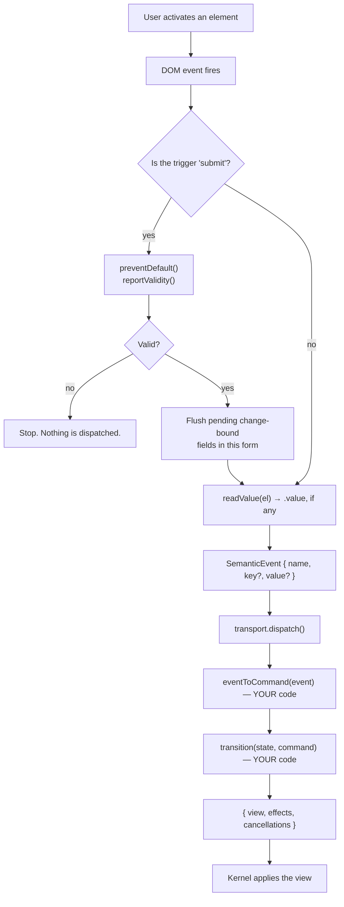

# Events and dispatch

**What this answers:** how a click in the browser becomes a state change, every
step of the way, with nothing hand-waved.

---

## The complete path



Steps 1–9 are the kernel's. Steps 10–11 are yours. The kernel does not
participate in deciding what anything means.

---

## What an event is

```ts
type SemanticEvent = {
  readonly kind: "Event";
  readonly name:   string;   // the data-event attribute value, verbatim
  readonly key?:   string;   // the enclosing data-each item's key, if any
  readonly value?: string;   // the element's .value, for form controls
};
```

That is the entire payload. Three optional-ish strings.

**There is no element id, no DOM node, no event object, no coordinates, no
modifier keys, no target reference.** The engine cannot know which element was
clicked, only which *name* was declared on it. This is deliberate: an engine
that knows about element ids is coupled to markup, and a change to the HTML
becomes a change to application logic.

### `name`

Whatever string you put in `data-event`. The kernel forwards it untouched and
never inspects it.

```html
<button data-event="addEntry">Add</button>
<!-- → SemanticEvent { kind: "Event", name: "addEntry" } -->
```

### `value`

Present only when the element is an `<input>`, `<select>`, or `<textarea>`.
`readValue()` returns `undefined` for everything else.

```ts
function readValue(el: HTMLElement): string | undefined {
  if (el instanceof HTMLInputElement || el instanceof HTMLSelectElement || el instanceof HTMLTextAreaElement) return el.value;
  return undefined;
}
```

Always a **string**, even for `type="number"` or `type="date"`. Converting and
validating is the engine's job:

```ts
const hours = Number(event.value ?? "");
if (!Number.isFinite(hours) || hours <= 0) { /* reject */ }
```

**Checkboxes and radios report `.value`, not `.checked`** — a known gap. See
[16-troubleshooting.md](16-troubleshooting.md#a-checkbox-always-reports-the-same-value).

### `key`

Present only when the event came from inside an instantiated `data-each` item.
It carries that item's key — the value of the field named by `data-key`.

```html
<template data-each="entries" data-key="id">
  <li>
    <button data-event="markProcessed">Mark processed</button>
  </li>
</template>
```

Clicking inside the row for entry `e1` sends
`{ name: "markProcessed", key: "e1" }`. This is the mechanism for "which one" —
there is no other.

---

## Which DOM event triggers a dispatch

The kernel picks a default from the tag name, and `data-on` overrides it.

```ts
const TRIGGER_BY_TAG = { FORM: "submit", INPUT: "change", SELECT: "change", TEXTAREA: "change" };
const trigger = el.getAttribute("data-on") ?? TRIGGER_BY_TAG[el.tagName] ?? "click";
```

| Element | Default trigger | Fires when |
| --- | --- | --- |
| `<form>` | `submit` | submitted (and `preventDefault()` is called for you) |
| `<input>`, `<select>`, `<textarea>` | `change` | the value is committed — **on blur**, not per keystroke |
| everything else (`<button>`, `<li>`, `<div>`, `<tr>`…) | `click` | clicked |

`data-on` accepts **any** DOM event type. There is no allow-list, because the
kernel just calls `addEventListener(trigger, …)`:

```html
<input data-event="search"  data-on="input">     <!-- every keystroke -->
<input data-event="commit"  data-on="blur">
<div   data-event="shortcut" data-on="keydown">
<video data-event="finished" data-on="ended">
```

### The `change` vs `input` distinction bites people

`data-on="input"` fires per keystroke. The default `change` fires on blur. If
your validation message "doesn't appear until I click away", this is why — and
the fix is `data-on="input"`, not engine code.

There is **no built-in debouncing** (ROADMAP item 16). `data-on="input"` on a
field that triggers a network effect will issue one request per keystroke. If
you need coalescing, the engine must implement it — by tracking a
`correlationId` and cancelling the previous request, not by adding a timer to
the kernel.

---

## Form submission: the pending-field flush

A real problem this solves: someone types into a field and presses Enter without
blurring. The field's `change` event has not fired. Without help, the engine
would submit a draft missing the last thing typed.

At bind time, every non-submit-triggered binding inside a `<form>` is registered
against that form:

```ts
const form = "form" in el ? (el as HTMLInputElement).form : null;
if (trigger !== "submit" && form !== null) {
  const pending = this.#flushable.get(form) ?? [];
  pending.push(fire);
  this.#flushable.set(form, pending);
}
```

On submit, those fire first, in order, and are awaited:

```ts
if (el instanceof HTMLFormElement) {
  if (!el.reportValidity()) return;
  for (const flush of this.#flushable.get(el) ?? []) await flush();
}
```

So the engine receives `nameChanged`, `emailChanged`, *then* `submit` — each as
a separate round trip.

This uses the native `.form` association, so a field associated by the `form="…"`
attribute is included even if it sits outside the element. And it is purely
mechanical: the kernel knows these bindings share a form element, not that they
constitute one logical draft.

---

## Mapping events to commands

This is your code and it is the only place the open string vocabulary from HTML
becomes a closed, typed one.

```ts
export function eventToCommand(event: SemanticEvent, correlationId: CorrelationId): Command {
  switch (event.name) {
    case "emailChanged":      return { kind: "CommitEmail", value: event.value ?? "" };
    case "checkAvailability": return { kind: "CheckAvailability", capability: "Http", correlationId };
    default: throw new Error(`Unrecognized event: ${event.name}`);
  }
}
```

Three rules:

1. **Reject unknown names.** Throwing is correct. A `data-event` typo should be
   loud, not a silent no-op you discover in production. The kernel's error
   boundary catches the throw, reports `BridgeError { phase: "dispatch" }`, and
   keeps the page alive.
2. **Validate `key` before trusting it.** It came from the DOM.
   [`examples/05-multi-screen/`](../examples/05-multi-screen/) narrows it to a
   known screen name and throws otherwise.
3. **Default `value` explicitly.** `event.value ?? ""` — the property is absent
   for non-form elements.

### Naming events

Name them for **what the user intended**, not what the element is.

| Prefer | Avoid | Why |
| --- | --- | --- |
| `markProcessed` | `buttonClick` | survives the button becoming a menu item |
| `emailChanged` | `input3Change` | the engine shouldn't know about element numbering |
| `retryLoad` | `clickRetry` | describes intent, not mechanism |

Several elements may share a name — `load` and `retry` in
[`examples/03-fetch-data/`](../examples/03-fetch-data/) map to the same command,
because they *are* the same intent.

---

## Event origin reference

| Origin | Example | Arrives as | Typical result |
| --- | --- | --- | --- |
| DOM click | `<button data-event="save">` | `Event { name: "save" }` | state transition, maybe an effect |
| DOM input | `<input data-event="x" data-on="input">` | `Event { name, value }` | draft update |
| DOM change (blur) | `<input data-event="x">` | `Event { name, value }` | committed field |
| Form submit | `<form data-event="submit">` | pending flushes, then `Event { name }` | validate and act |
| List item | `data-event` inside `data-each` | `Event { name, key }` | act on that item |
| Kernel startup | — | `Initialize { protocolVersion, capabilities }` | project initial view, maybe load |
| Http completion | engine requested it earlier | `EffectResult { HttpResult }` | record evidence |
| Storage completion | engine requested it earlier | `EffectResult { StorageResult }` | record evidence |
| Browser history | **not supported** | — | see [08-multi-screen-applications.md](08-multi-screen-applications.md) |
| Timers | **not supported** | — | ROADMAP item 16 |

The bottom two rows are honest gaps, not omissions from this table.

---

## Timing: what is synchronous and what is not

This trips up tests constantly, so it is worth stating precisely.

- The **dispatch** happens synchronously inside the DOM event's own call chain.
  Immediately after `element.click()` returns, `transport.dispatch` has been
  called.
- **Applying the response** happens after a microtask boundary, because
  `dispatch` returns a promise.

In tests: asserting on *what was dispatched* is safe immediately; asserting on
*resulting DOM state* needs a yield first.

```ts
button.click();
assert.equal(transport.calls.length, 2);       // safe now
await flush();                                  // setTimeout(resolve, 0)
assert.equal(p.textContent, "Saving…");         // needs the yield
```

Getting this wrong produces tests that pass for the wrong reason or fail
flakily. See [09-testing-and-debugging.md](09-testing-and-debugging.md).

---

## Common mistakes

| Symptom | Cause | Fix |
| --- | --- | --- |
| Nothing happens on click | element added to the DOM after `start()` | only `data-if`/`data-each` add bindable content later |
| Value is always `undefined` | `data-event` on a `<div>`, not a form control | put it on the input, or read from state instead |
| Fires only on blur | default `change` trigger | `data-on="input"` |
| `key` is `undefined` | element isn't inside a `data-each` instance | pass identity another way |
| Page submits and reloads | `data-event` is on the button, not the `<form>` | move it to the `<form>` — that's what triggers `preventDefault()` |
| Two events per click | `start()` was called twice | call it once |

---

## Related

- [03-kernel-lifecycle.md](03-kernel-lifecycle.md) — where dispatch sits in the round trip
- [04-state-model.md](04-state-model.md) — what commands do once they arrive
- [06-rendering.md](06-rendering.md) — the return journey
- [11-api-reference.md](11-api-reference.md) — exact type signatures
